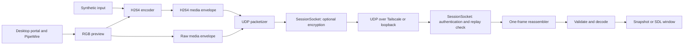

---
tags:
  - larp
  - technical-study
project: ../..
reviewed: 2026-10-03
---

# Architecture and frame flow

The central design is a pipeline with bounded reusable storage. Transport carries bytes without knowing whether they represent a synthetic pattern, raw RGB, or H.264.

Synthetic byte transport bypasses both media envelopes and the codec. It tests the network path with a predictable byte pattern.

## Where responsibilities live

| Directory    | Responsibility                                                            | Entry points to read                                         |
| ------------ | ------------------------------------------------------------------------- | ------------------------------------------------------------ |
| `host/`      | Parse sender mode, acquire input, encode, schedule, send                  | `main.cpp`, `capture_main`, `h264_synthetic_main`            |
| `client/`    | Receive, pin peer, dispatch control, reconstruct, decode, present, report | `main.cpp`                                                   |
| `platform/`  | IPv4 UDP socket and OS error handling                                     | `Endpoint`, `UdpSocket`                                      |
| `protocol/`  | Byte layout and validation                                                | `Header`, `Probe`, `Feedback`                                |
| `transport/` | Frame reconstruction, packetization, feedback, bitrate decisions          | `Reassembler`, `send_frame`, `RateControl`, `AdaptiveSender`, `SessionSocket` |
| `capture/`   | Screen permission, PipeWire input, RGB conversion                         | `ScreenCapture`, `open_screen_capture`                       |
| `media/`     | Raw RGB envelope                                                          | `RawFrameView`, `read_raw_frame`                             |
| `codec/`     | FFmpeg encoding, decoding, H.264 envelope                                 | `H264Encoder`, `H264Decoder`                                 |
| `render/`    | Window events and RGB presentation                                        | `VideoWindow`                                                |
| `common/`    | Monotonic clock, numeric parsing, bitrate limits                          | `now_us`, `number`                                           |

The UDP interface hides Linux socket structures. The capture interface hides PipeWire. Codec and window classes use private `Impl` objects so their headers do not expose FFmpeg or SDL details. These boundaries do not imply Windows implementations already exist. CMake rejects a non-Linux socket build.

## Follow a synthetic H.264 frame

`host/main.cpp` routes `--h264-synthetic` to `h264_synthetic_main`. That function creates a `SessionSocket`, an encoder, reusable RGB and encoded buffers, and an optional adaptive controller. With `--key-file`, it authenticates the receiver before encoding begins. Without a key it delegates to the existing plaintext UDP socket.

Before each frame, `AdaptiveSender::wait_until` waits for the deadline, services secure session heartbeats, and processes feedback when enabled. The host applies the resulting bitrate, fills the RGB pattern, records a local timestamp, and calls `H264Encoder::encode`.

`send_frame` fragments the resulting media envelope and compressed picture into UDP datagrams. In adaptive mode it spaces the packets. After sending, the host advances the next deadline, clamping it to the current time when it falls behind. It does not queue missed frame deadlines.

The client polls window events, then waits at most 10 ms for UDP input. It expires incomplete frames even when traffic stops. Recognized feedback control packets take a separate path before media accounting.

In plaintext mode, the first structurally valid media packet pins the source endpoint. Secure mode first checks the configured peer address, authenticates the envelope, and rejects replayed counters. Only decrypted application packets reach media and feedback processing. A new authenticated generation resets partial reassembly, peer selection, and decoder state. See [LARP - Session security and recovery](LARP%20-%20Session%20security%20and%20recovery.md). `Reassembler::accept` either rejects the packet, updates the active frame, or returns a complete borrowed byte span. The client consumes that span immediately. H.264 mode decodes into a reusable RGB buffer, then saves the first valid image or calls the window's `present` method.

## Separate transport completion from usable video

A complete packet set increments `completed` before media validation. A failed CRC or decoder check increments `Corrupt` rather than transport loss. `Validated` counts usable frames. `Presented` counts successful presentations of received frames.

This distinction explains why a transport can report complete delivery while the media is unusable. It also explains why resize redraws do not increase `Presented`.

## Threading and ownership

Application capture, send, receive, decode, and present work runs synchronously in each process. There are no application worker queues. External libraries and desktop services have their own internals, so this is not a claim that the entire system has only one thread.

Synchronous work makes lifetimes easier to follow, but encoding or presentation pauses the application's next network operation. Bounded memory alone does not guarantee low latency.

Sources: [sender entry](../../host/main.cpp), [H.264 sender](../../host/h264_main.cpp), [receiver](../../client/main.cpp), [build configuration](../../CMakeLists.txt).

Next: [LARP - UDP protocol and reassembly](LARP%20-%20UDP%20protocol%20and%20reassembly.md).
