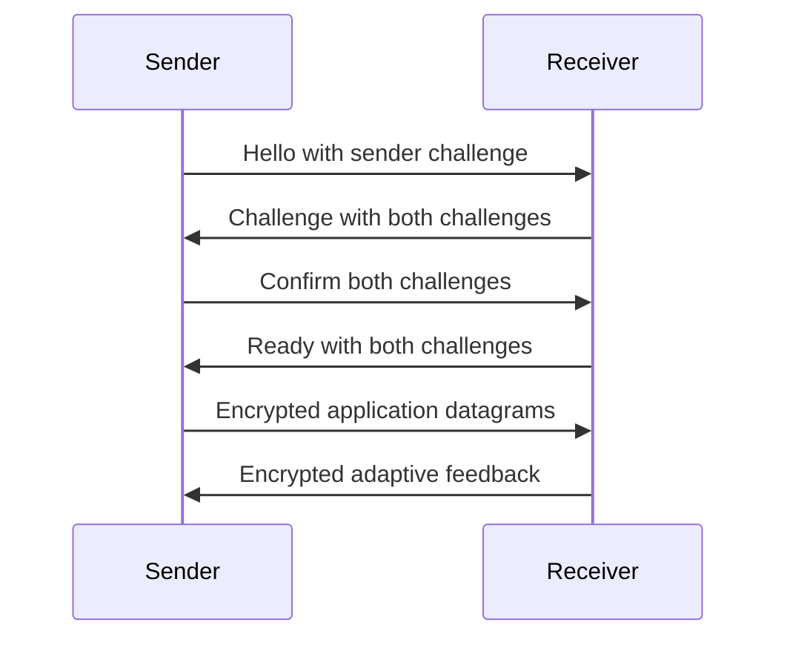

---
tags:
  - larp
  - technical-study
project: ../..
reviewed: 2026-10-03
---

# Session security and recovery

Tailscale supplies connectivity between the Linux machines. Milestone 12 adds
an optional LARP session layer that authenticates the peer, encrypts application
datagrams, rejects replayed packets, and recovers when either process restarts.
It does not add custom NAT traversal or a separate relay.

## Put the session boundary before application parsing

`SessionSocket` owns the existing `UdpSocket`. Without a key it delegates to
plaintext UDP behavior. With a key, the receiver verifies the expected source
IP, envelope, authentication tag, active endpoint, and replay counter before
returning any application bytes.

Media and feedback use this same boundary. The existing `LARP` fragment header,
H.264 envelope, and `LAFB` feedback layouts stay unchanged inside encryption.
An invalid encrypted packet cannot pin the media peer, enter reassembly, or
change the adaptive controller's measurements.

## A shared key authenticates a fresh handshake

`larp-keygen PATH` creates a random 32-byte key with mode `0600` and refuses
to overwrite an existing file. Both peers need a copy owned by their process
account. Loading rejects symlinks, named pipes, nonregular files, wrong lengths,
and group or other permission bits. Named pipes are opened without blocking
before their file type is rejected.

The sender generates a fresh 16-byte challenge. The receiver contributes a
second fresh challenge and accepts only a matching confirmation from the
candidate endpoint.

All handshake messages use authenticated encryption under the shared key.
Repeating a valid confirmation for the active session resends ready without
resetting counters. Recorded hello and confirm messages cannot establish a
new session against a fresh receiver challenge.

Keyed BLAKE2b hashes the challenges into a session base key. Libsodium's KDF,
with context `LARPv001`, derives separate sender-to-receiver and
receiver-to-sender keys. Key storage is wiped on destruction.

## Encrypt packets without changing fragment capacity

The outer `LASE` envelope contains an eight-byte authenticated header, a
24-byte nonce, ciphertext, and a 16-byte authentication tag. It uses
XChaCha20-Poly1305 from libsodium.

The overhead is 48 bytes. A full 1,200-byte application datagram becomes a
1,248-byte UDP payload, or 1,276 bytes with IPv4 and UDP headers. It fits a
1,280-byte Tailscale MTU. Fragment payload capacity remains 1,166 bytes.

Application nonces combine the sending peer's 16-byte challenge and a nonzero
64-bit counter. A 1,024-counter replay window allows bounded reordering while
rejecting duplicates and old counters. Authentication succeeds before the
window advances, so an unauthenticated high counter cannot invalidate later
legitimate packets. Handshake and heartbeat transmissions instead use fresh
random 24-byte nonces.

## Recovery changes the session generation

The sender services heartbeats between video frames, including synthetic-byte
frames at one FPS. Each ping carries both session challenges and a fresh request
challenge. Only a matching pong can answer it. A missing reply for one second,
or an authenticated reply saying that the receiver has lost the session,
starts a new handshake.

Handshake messages retry every 250 ms. Candidates expire after three seconds;
sender retries then use a new challenge. Initial authentication has a five-second
deadline. Later recovery continues within the sender's existing runtime limit.
The receiver allows replacement of an idle session after one second without
authenticated application traffic.

Every completed handshake increments a generation. On a new generation, the
receiver clears incomplete frame state, peer selection, and decoder state.
It retains cumulative statistics and its reusable RGB output buffer.
`AdaptiveSender` recreates its controller at the current bitrate with a fresh
probe session and feedback baseline.

Frames produced while authentication is incomplete are discarded. There is
no replay queue or video retransmission. The sender retains at most the latest
decrypted application feedback datagram.

`Sessions` counts authenticated generations. `Security rejected` counts
envelopes rejected before application processing. `Unsent` counts application
datagram attempts withheld without an active session, including probes.
Encoded-frame and packetization counters include those attempts, so they are
not delivery confirmations.

## Acceptance and its limits

The October 3 software suites passed 26 local Release tests, 26 local sanitizer
tests, 24 remote Release tests, and 21 remote non-NVIDIA sanitizer tests. Final
targeted session checks passed after key-file and low-FPS heartbeat refinements.

The two-machine encrypted checks use synthetic video and SDL dummy displays.
They work with the screen locked and do not capture desktop content.

| Local build | Frames before receiver restart | Frames after receiver restart | Frames across sender restart |
| --- | ---: | ---: | ---: |
| Release | 113 | 156 | 120 |
| ASan, LSan, and UBSan | 112 | 156 | 120 |

All listed frames were decoded and presented. Neither run reported corruption,
and the sanitizer run reported no sanitizer diagnostics. Recovery does not
promise delivery during the intentional interruption. Old-session traffic is
rejected, some frame attempts are withheld, and the sanitizer receivers each
recorded an incomplete frame at shutdown or session transition.

The negative fixture checks tampering, forged high counters, duplicates,
bounded fragment reordering, retired-session replay, wrong keys and source
addresses, key-file validation, process restarts, and a 1.5-second complete
network blackhole. These checks verify specific behavior; they do not replace
an independent security audit.

This shared-key design has no forward secrecy. A compromised key permits
impersonation and decryption of recorded sessions. Key distribution and
Tailscale access policy remain deployment responsibilities. NVIDIA leaks and
Windows implementation are separate blockers, as recorded in [LARP - Study map](LARP%20-%20Study%20map.md).

Sources: [session API](../../transport/session.hpp),
[implementation](../../transport/session.cpp),
[production integration test](../../tests/secure_sessions.py),
[two-machine benchmark](../../benchmarks/secure_tailscale.py),
[setup commands](../sessions.md), and
[acceptance report](../session-verification.md).

Continue with [LARP - Decisions and evidence](LARP%20-%20Decisions%20and%20evidence.md) or [LARP - Study exercises](LARP%20-%20Study%20exercises.md).
